# Light Field Applications with a Camera Slider

陈昱文 于倚岑 陈易

## 项目目标

- 搭建一个相机导轨
- 利用拍摄的图片合成一个大光圈，实现重聚焦
- 根据EPI进行深度采集

## 项目简介

在课上我们已经学习过光场和epi的有关概念，并介绍了重聚焦的有关方法。在我们的项目中，我们利用相机导轨等距拍摄了若干小孔径照片，然后利用得到的epi生成大孔径照片，实现重聚焦。之后，利用深度越深，在epi上的线的斜率越小的原理，可以计算出物体的深度，通过算法优化和滤波后得到最终的深度图和重建结果。

## 项目实现

### 硬件

在项目前期，为确保我们的算法可以正常工作，我们首先只采用了软件模拟，使用斯坦福棋盘光场数据集进行测试，其拍摄效果如下。

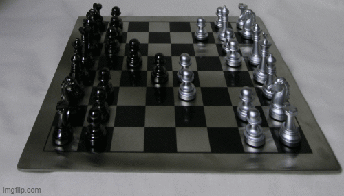

在程序在棋盘上得到正确结果后，我们借到了相机导轨，拍摄时，每次相机移动相等的足够小的距离，拍摄出一组照片。

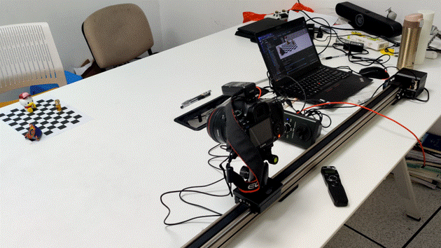

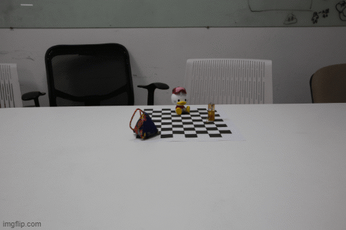

最终，我们受到斯坦福光场相机的启发，使用乐高搭建了一个相机导轨，由于积木底面比较光滑，拍摄时为了防止电机转动导致导轨位移，我们用一块电源压住导轨。电机设定为每次启动时旋转180度，采用螺纹和齿轮的组合进行减速，确保拍照的距离间隔不会太长。

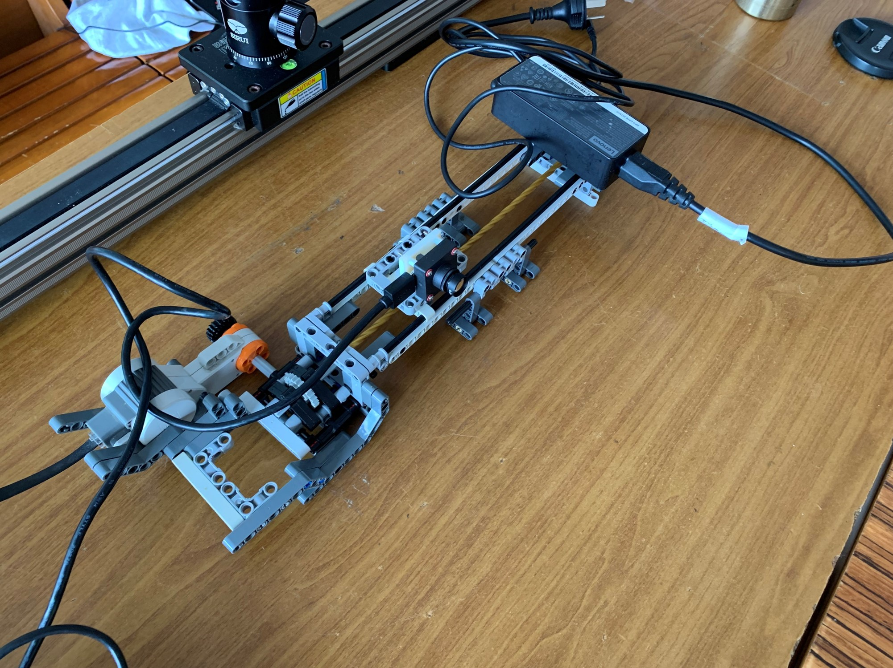

### 重聚焦

为了实现重聚焦，我们需要首先得到epi，把所有图片的某一行拼在一起就得到了epi，对于每一列求出平均值，这样我们得到了重聚焦后的图像。

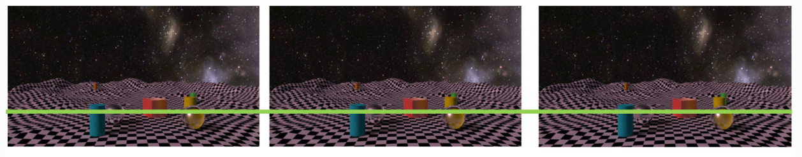

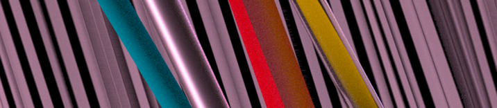

由于epi的每条线的斜率代表它在现实中的深度。我们可以通过倾斜epi改变每条线的斜率来前后移动焦平面。

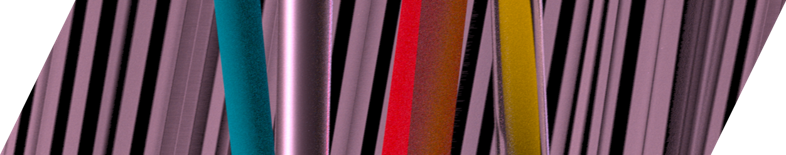

得到的结果和使用大孔径光卷的相机拍摄结果对比（左图是重聚焦的结果，右图是相机拍摄的结果）：

 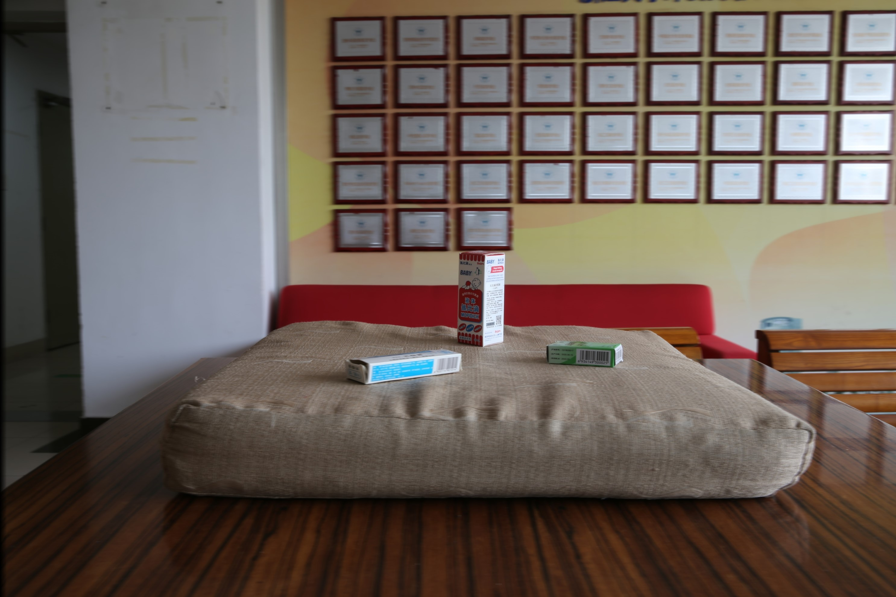                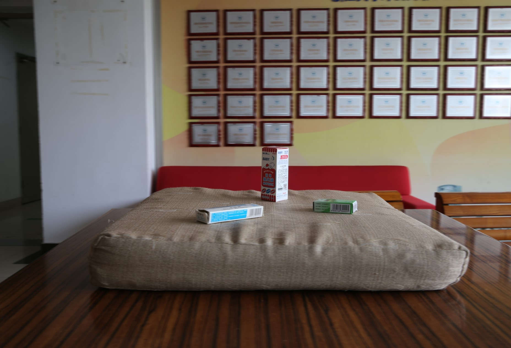

文件夹中refocus1.jpg和refocus2.jpg是前后移动焦平面的结果。

由于我们只在一维导轨上拍照，所以我们的重聚焦结果只是一种近似结果，要得到更精准的结果需要一个二维的相机阵列。

### 生成深度图

根据生成的epi，我们可以知道每一条线所对应的深度。

如图所示，考虑相机平面$st$和图像平面$uv$，当相机移动时，P在图像平面移动距离的关系为$\begin{equation} \Delta u=-\frac {f}{Z}\cdot \Delta s \end{equation}$

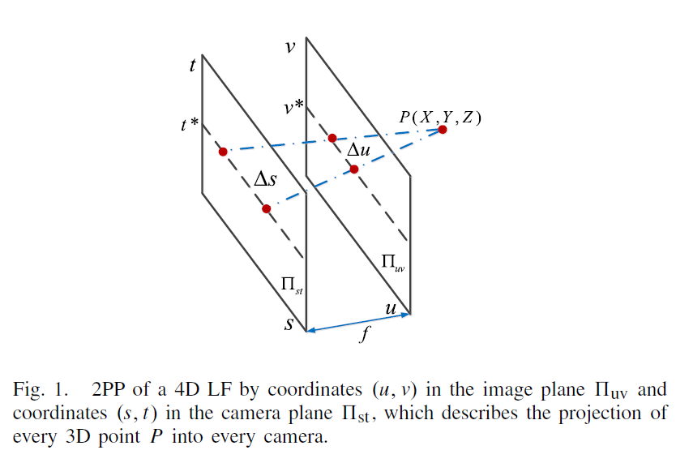

如果我们知道$\Delta u$, $\Delta s$, $f$，我们就可以求出深度$\begin{equation} Z=-f\frac {\Delta s}{\Delta u} \end{equation}$。现在我们的目标就是找到每个点在epi上对应的线，以便求出$\Delta s/ \Delta u$。

首先我们生成横向和纵向的epi，现在我们要对每个像素计算在epi上最合适的斜线。定义$o=(u,v)$为当前考虑的像素，$E_i$为当前考虑的第$i$行（或列）的epi图像，最优的角度可以被表示为:$\begin{equation} \theta ^{\ast }( {o,E_{i}} )=\arg \min \limits _{\theta \in \Theta } C_{\theta } ( {o,E_{i}} ) \end{equation}$，$C_{\theta } ( {o,E_{i}} )$为角度为$\theta$时的代价函数。那么之后的任务就是定义这个函数。

一个最简单的考虑是对于枚举的每个角度，计算在这个角度的直线上的所有像素和这个像素灰度值的差的绝对值，把它们的平均值当作代价。

​                                                                     $\begin{align}&\hspace {-1.3pc}C_{\theta } ( {o,E_{i}} )=\frac {1}{| {S( \theta )} |}\sum \limits _{q\in S( \theta )}\!{{ {\begin{array}{l}  {\| {I( q )-I(o)} \|^{l}}   \\ \end{array}} }}\qquad \end{align}$

画出的线结果如下：

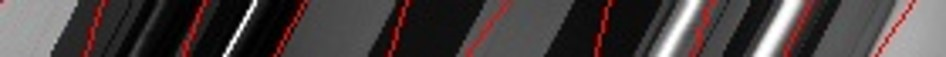

看到一些线与它们的边缘差距较大，我们加入梯度。在计算时，不只考虑每个像素对结果的影响，也把他们与x方向和y方向的梯度考虑进去。

​                                                               $\begin{align}&\hspace {-1.3pc}C_{\theta } ( {o,E_{i}} )=\notag \\&\frac {1}{| {S( \theta )} |}\sum \limits _{q\in S( \theta )}\!{\left ({ {\begin{array}{l} ( {1\!-\!\alpha } )\min ( {\| {I( q )-I(o)} \|^{l},\tau _{1}} ) \\ +\alpha \min \left ({ {\begin{array}{l} \| {I_{x} ( q )-I_{x} (o)} \|^{l} \\ +\| {I_{y} ( q )-I_{y} (o)} \|^{l},\tau _{2} \\ \end{array}} }\right ) \\ \end{array}} }\right )}\qquad \end{align}$

其中$\alpha$是平衡两部分的参数，$I_x(o)$表示像素o在x方向上的梯度，可以使用Sobel算子计算，$I_y(o)$同理。$\tau_1,\tau_2$是截断总和。

结果如下：

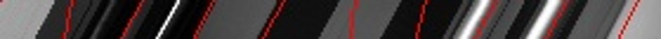

观察到其中一些线有明显曲折。

扩大考虑点的范围，把这条线附近的其他像素也算进去。在原来的函数基础上定义新的代价函数：

​                                                      $\begin{align} C_{\theta ,e} ( {o,E_{i}} )=&\sum \limits _{\Delta \in X} {\exp \left ({ {-\frac {\| \Delta \|^{l}}{\sigma _{s}}-\frac {\| {I(o)-I( {o+\Delta } )} \|^{l}}{\sigma _{c}}} }\right )}\notag \\&\times C_{\theta } ( {o+\Delta ,E_{i}} ) \end{align}$

最终结果如下：

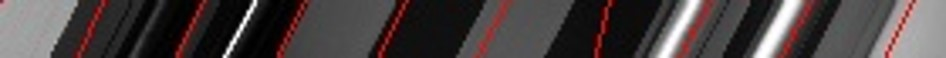

根据得到的结果求出深度值，加入导向滤波，得到最终的深度图。下面是原始图片、用原深度图导向滤波，用原图导向滤波。使用原图滤波效果较好一些。

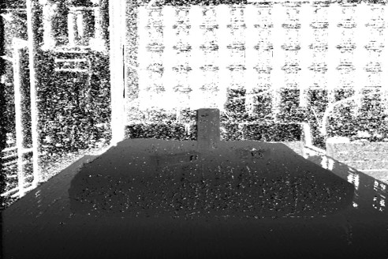      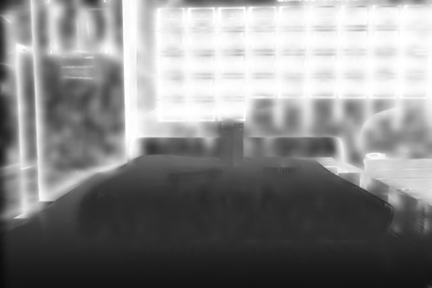

最后3D重建，输出ply文件。

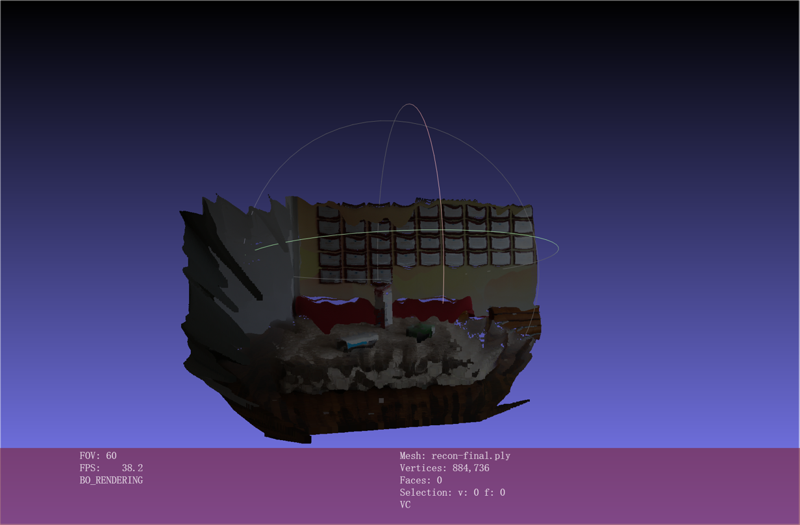

## 项目分析

1.分析图片数量对深度图结果的影响

我们拍摄的场景如图。

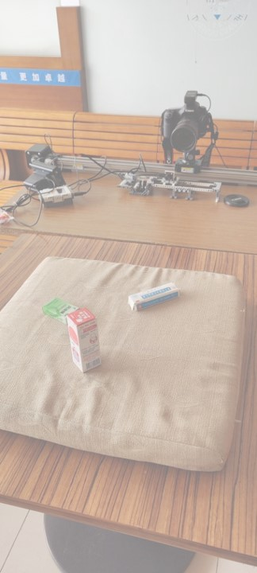

以下四幅图片分别是连续拍摄5, 15, 30, 60张照片时生成的深度图。

   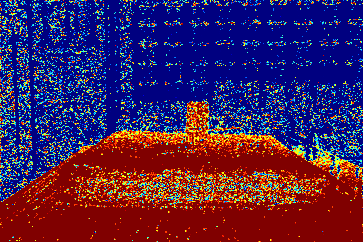       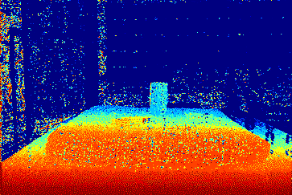

   
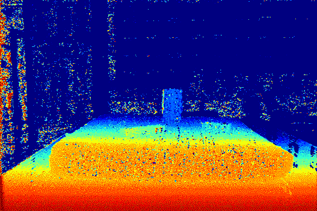       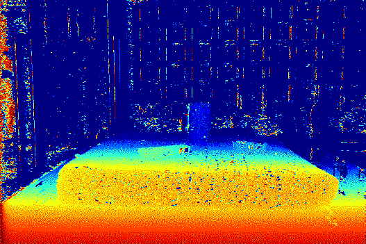  

可以看到在使用15张图片时深度图上已经可以正确观察到不同物体的深度，而从30张照片到60张照片，生成的深度图在整体结果上的质量差距不大。由于照片的增加会带来运行效率的降低，所以在生成结果时我们通常拍摄20-30张照片。

2.与其他深度采集方法的对比

(1) 与双目相机估计深度的对比

​	对比双目相机和我们的基于EPI估计深度的方法生成的深度图。左边是双目相机生成的深度图，右边是epi生成的深度图。

   
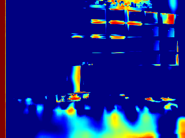     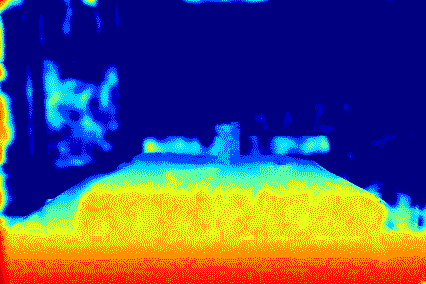

​	可以发现双目相机生成的深度图在比较平坦的区域和一些有重复特征的区域（如包装盒上的二维码被显示成了红色）表现很差，而我们的方法在这些情况上处理的很好，由于这些重复特征在epi上都表现为各自的一条线，所以不容易出错。

(2) 与结构光估计深度的对比

​	结构光在深度估计时的精度很高，但其容易受外部光照条件的干扰，所以只能适用于实验室环境。而我们的导轨可以在普通的环境下拍摄，适用性更强。

(3)与激光估计深度的对比

​	激光也是一种精度较高的估计深度的方法，但对于一些可能会出现二次反射的物体，它的表现可能会较差。我们的epi估计深度的方法可以解决这方面的问题。

3.利用epi计算深度的局限性

​	对于一个颜色相同的物体，我们在epi图上仅能看到它的左边缘和右边缘，而它中间的形状我们无法得到（如可能是一个平面，也可能是凹面或凸面），我们只能通过算法去猜测这些情况。一个可能的方法是使用AI学习不同情况的epi的真实结果以提高准确度。

## Presentation后的工作

将深度图变为了彩色，便于观察结果。

##  参考文献

[1] A. Isaksen, L. McMillan, and S. J. Gortler, “Dynamically reparameterized light fields,” in *Proceedings of the 27th annual conference on Computer graphics and interactive techniques*, USA, Jul. 2000, pp. 297–306. doi: [10.1145/344779.344929](https://doi.org/10.1145/344779.344929).

[2] V. Vaish *et al.*, “Synthetic Aperture Focusing using a Shear-Warp Factorization of the Viewing Transform,” *2012 IEEE Computer Society Conference on Computer Vision and Pattern Recognition Workshops*, vol. 0, p. 129, Jan. 2005, doi: [10.1109/CVPR.2005.537](https://doi.org/10.1109/CVPR.2005.537).

[3] Y. Zhang *et al.*, “Light-Field Depth Estimation via Epipolar Plane Image Analysis and Locally Linear Embedding,” *IEEE Transactions on Circuits and Systems for Video Technology*, vol. 27, no. 4, pp. 739–747, Apr. 2017, doi: [10.1109/TCSVT.2016.2555778](https://doi.org/10.1109/TCSVT.2016.2555778).

[4] N. Lyu, J. Zuo, Y. Zhao, and C. Zhang, “Terahertz Synthetic Aperture Imaging with a Light Field Imaging System,” *Electronics*, vol. 9, no. 5, Art. no. 5, May 2020, doi: [10.3390/electronics9050830](https://doi.org/10.3390/electronics9050830).